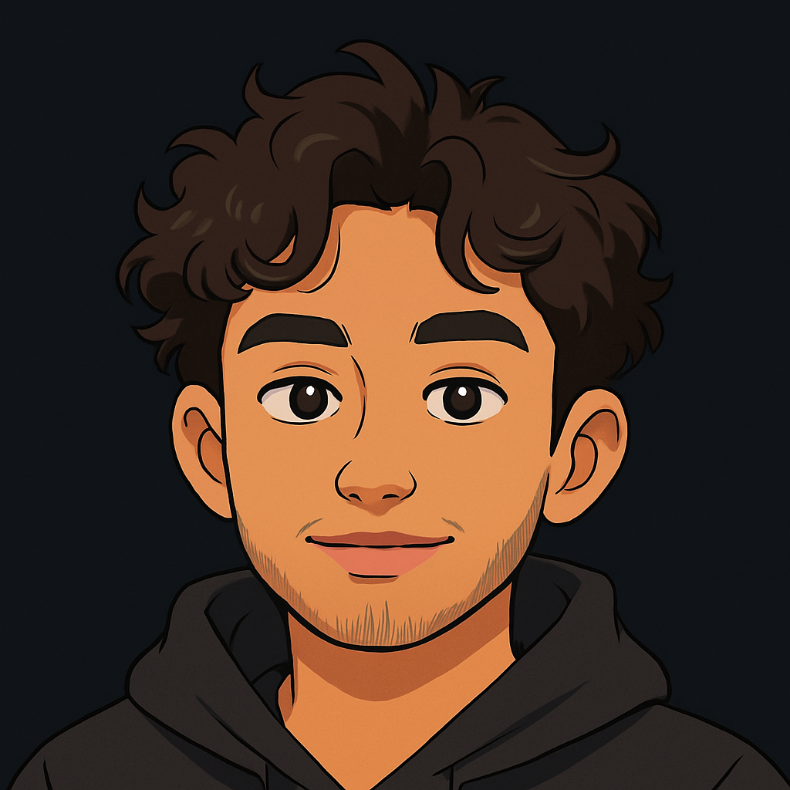

    
  
    
  
  
  ### cog sci w/specialization in neuroscience @ UCSD 

###

<h2 align="left">About me</h2>

###

- 🔭 I'm currently working on Maatoukie's Mate - 🌱 I'm currently learning tailwind css, python, machine learning, data structures - 👯 I'm looking to collaborate on fullstack, gen ai, or any cool projects - 💬 Ask me about anything automotive related! - 📫 How to reach me: z5ali@ucsd.edu - 📄 My resume: (https://my-resume92.tiiny.site)

###

<h2 align="left">I code with</h2>

###

  
  
  
  
  
  
  
  
  
  
  
  
  
  
  
  
  

###

  
  

